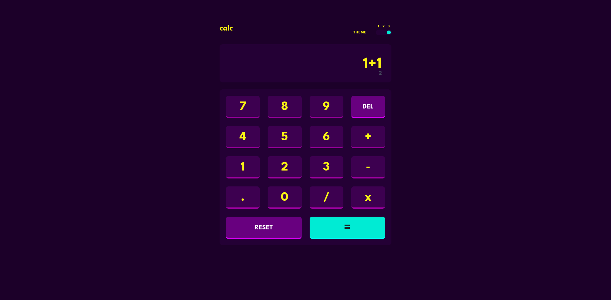

# Frontend Mentor - Calculator app solution

This is a solution to the [Calculator app challenge on Frontend Mentor](https://www.frontendmentor.io/challenges/calculator-app-9lteq5N29). Frontend Mentor challenges help you improve your coding skills by building realistic projects.

## Table of contents

-   [Overview](#overview)
    -   [The challenge](#the-challenge)
    -   [Screenshot](#screenshot)
    -   [Links](#links)
-   [My process](#my-process)
    -   [Built with](#built-with)
    -   [What I learned](#what-i-learned)
    -   [Continued development](#continued-development)
-   [Author](#author)
-   [Acknowledgments](#acknowledgments)

**Note: Delete this note and update the table of contents based on what sections you keep.**

## Overview

### The challenge

Users should be able to:

-   See the size of the elements adjust based on their device's screen size
-   Perform mathmatical operations like addition, subtraction, multiplication, and division
-   Adjust the color theme based on their preference
-   **Bonus**: Have their initial theme preference checked using `prefers-color-scheme` and have any additional changes saved in the browser

### Screenshot

### Links

-   Solution URL: [Solution URL](https://github.com/Danii215/Calculator)
-   Live Site URL: [Live Site URL](https://calculator-seven-green.vercel.app/)

## My process

### Built with

-   Semantic HTML5 markup
-   CSS custom properties
-   Flexbox
-   CSS Grid
-   [React](https://reactjs.org/) - JS library
-   [Vite](https://vitejs.dev/) - Development tool
-   [TypeScript](https://www.typescriptlang.org/) - Organizing and making the code sustanaible
-   [Sass/Scss](https://sass-lang.com/) - For styles

### What I learned

This is the second project I work with react + ts. The first one was a newsletter, also hosted on my github. I am really confident and happy with my new react + ts skills and wish to invest more in them in the future. I also liked the agility of Vite.

### Continued development

I wish to come back to this project again some other time and make more functions, play a little more with typescript :)

## Author

-   Github - [Danii215](https://github.com/Danii215)
-   Frontend Mentor - [@yourusername](https://www.frontendmentor.io/profile/Danii215)

## Acknowledgments

I worked in this project mostly alone, but I still want to give some acknowledgements for my friend Ezequiel Nilo for hyping me up to study!
